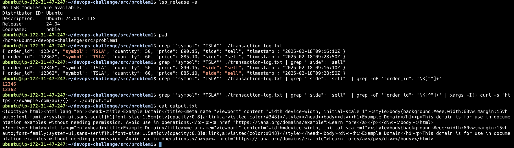

## Answer

 ### Provide the CLI command here:

```bash
grep '"symbol": "TSLA"' ./transaction-log.txt | grep '"side": "sell"' | grep -oP '"order_id": "\K[^"]+' | xargs -I{} curl -s "https://example.com/api/{}" > ./output.txt
```

### Explain the command

The command is a four-stage pipeline:

1. **`grep '"symbol": "TSLA"' ./transaction-log.txt`** - Reads the transaction log and filters to only lines where the symbol is `TSLA`.

2. **`grep '"side": "sell"'`** - From those TSLA lines, keeps only the ones with `"side": "sell"`, satisfying the "selling TSLA" requirement.

3. **`grep -oP '"order_id": "\K[^"]+'`** - Extracts the raw order ID value from each matching line.
   - `-o` outputs only the matched portion (not the full line).
   - `-P` enables Perl-compatible regex.
   - `\K` is a lookbehind reset - it matches `"order_id": "` but excludes it from the output.
   - `[^"]+` captures everything up to the next quote, i.e. the order ID itself.

4. **`xargs -I{} curl -s "https://example.com/api/{}" > ./output.txt`** - For each order ID emitted by the previous stage, substitutes it into the URL and executes a GET request.
   - `-I{}` defines `{}` as the placeholder that gets replaced with each input line.
   - `curl -s` runs silently (no progress bar).
   - `> ./output.txt` redirects the combined output of all curl responses into the file.

### Evidence

Command executed on Ubuntu 24.04 (x86):


