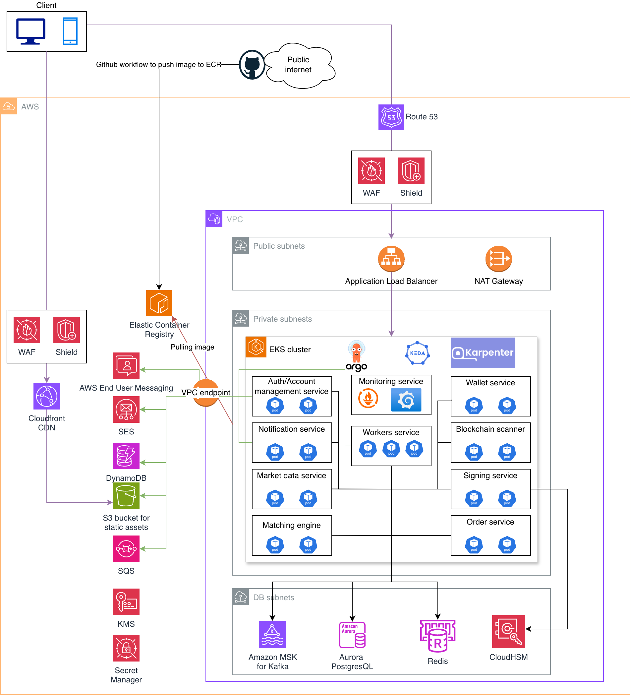

# Problem 2: Highly Available Trading System Architecture

## Overview

The architecture follows a microservices pattern deployed on Amazon EKS, with event-driven communication via Kafka, strong security boundaries through network segmentation, and GitOps-based continuous delivery.

## Network Architecture

### VPC Design

The system is deployed within a single VPC, segmented into three subnet tiers across multiple Availability Zones for high availability:

| Subnet Tier | Purpose | Accessibility |
|-------------|---------|---------------|
| **Public subnets** | Application Load Balancer (API + WebSocket), NAT Gateway | Internet-facing |
| **Private subnets** | EKS nodes, application workloads | No direct internet access |
| **DB subnets** | Aurora PostgreSQL, MSK, Redis | Accessible only from private subnets |

**VPC Endpoints**: let application pods communicate with AWS services (ECR, DynamoDB, S3, SNS, SQS) through it, keeping traffic on the AWS backbone and avoiding NAT Gateway data processing charges for high-volume internal calls.

**NAT Gateway**: is provisioned for cases where pods need outbound internet access (e.g., calling external blockchain RPCs or third-party APIs).

---

## Edge & Security Layer

### Traffic Routing

| Traffic Type | Path |
|-------------|------|
| **Static assets** (JS, CSS, images) | CloudFront → S3 origin bucket |
| **REST API** (orders, account, wallet) | Client → WAF/Shield → ALB → EKS |
| **WebSocket** (market data, trade updates) | Client → WAF/Shield → ALB → EKS |

CloudFront is **not** placed in front of the ALB. CloudFront has a 30-second idle timeout on WebSocket connections. With the direct Route 53 to ALB path, WebSocket connections terminate at the regional ALB which has native WebSocket support with configurable idle timeouts

### AWS WAF & AWS Shield

- **AWS WAF**: Rate-based rules, geo-blocking, and bot detection. Blocks common attack patterns (SQL injection, XSS) and rate-limits by IP.
- **AWS Shield Advanced**: 24/7 access to the Shield Response Team (SRT), near real-time metrics, automated layer 7 mitigation, and cost protection against scaling charges.

---

## Compute Layer: Amazon EKS

### Why EKS over ECS

All microservices run on **Amazon Elastic Kubernetes Service (EKS)** in private subnets. Kubernetes was chosen because:

- **Standardized deployment model** - Every service is a container with well-defined resource requests/limits, health checks, and rollout strategies.
- **Internal service communication** - Within the EKS cluster, services communicate via **Kubernetes Services (ClusterIP)** and DNS-based service discovery (`<service>.<namespace>.svc.cluster.local`). This provides load-balanced, low-latency internal calls without leaving the cluster network that ECS requires additional AWS services (Cloud Map, App Mesh) to partially replicate.
- **Service mesh support** - Kubernetes natively supports service discovery, and tools like Istio or Linkerd, enabling **mTLS** between all pods, fine-grained traffic policies (canary releases, circuit breaking, retries with budgets), and deep observability (per-request latency histograms, error rates). ECS has limited service mesh support through AWS App Mesh, which is less mature, has a smaller community, and lacks the rich traffic management features of Istio/Linkerd.
- **Ecosystem maturity** - Helm charts, operators, and the CNCF ecosystem provide battle-tested solutions for logging, monitoring, and secrets management.

### Pod autoscaling with KEDA

**KEDA (Kubernetes Event-Driven Autoscaling)** supplements the Horizontal Pod Autoscaler by scaling pods based on external metrics:

- **CPU/Memory Utilization**
- **Kafka consumer lag**
- **HTTP request rate**
- **SQS queue depth**
- **Custom Prometheus metrics**

This is more responsive than CPU/memory-based HPA alone, critical for a trading system where latency spikes directly impact users.

### Alternatives Considered

| Decision | Chosen | Alternative | Rationale |
|----------|--------|-------------|-----------|
| Compute platform | EKS (Kubernetes) | ECS | Mentioned on section "Why EKS over ECS" above |

---

## Data Layer

All stateful components are deployed in isolated **DB subnets** (no internet route), accessible only from private subnets where EKS nodes run.

### Aurora PostgreSQL

**Primary relational database** for transactional data. Deployed Multi-AZ with automatic failover (RPO = 0), read replicas for query offloading, and PgBouncer sidecar containers for connection pooling.

| Consumer Service | Data Stored |
|-----------------|-------------|
| **Wallet Service** | Double-entry balance ledger, deposit/withdrawal records (writer, serializable isolation) |
| **Order Service** | Order history, order status tracking (writer) |
| **Market Data Service** | Historical trade data, K-line/candlestick aggregations (writer + read replica) |
| **Auth/Account Management** | User accounts, KYC records, API key hashes (writer) |
| **Matching Engine** | Trade execution records (writer, post-match persistence) |

**Alternative consider - Why Aurora over standard RDS PostgreSQL**: Aurora's storage layer replicates data 6 ways across 3 AZs, survives the loss of an entire AZ without data loss, and provides up to 5x throughput improvement over standard PostgreSQL.

### Amazon ElastiCache (Redis)

**Low-latency caching layer** for real-time market data, recovery snapshots, and rate limiting, deployed as a Redis Cluster (cluster mode enabled) across 3 Availability Zones.

| Consumer Service | Usage | Why Redis |
|-----------------|-------|-----|
| **Order Service** | per-user/IP rate-limiting counters with TTL-based expiry | Multiple API pods serve the same user. A shared atomic counter in Redis ensures accurate global rate limiting across all pods.
| **Market Data Service** | Current best bid/ask, last price, 24h stats per pair. Order book depth snapshots  | Updated hundreds of times/sec, read thousands of times/sec. Served to clients with minimal latency
| **Matching Engine** | Full order book snapshots (all resting orders, price levels, Kafka offset). Write-only during normal operation — read only during pod recovery. | Enables fast crash recovery. New pod loads snapshot from Redis and replays only the Kafka tail, reducing rebuild time from minutes to seconds.

**Alternative consider - Why Redis over Memcache**: Redis supports richer data structures (sorted sets for leaderboards, pub/sub for real-time) and persistence.

### Amazon MSK (Managed Streaming for Apache Kafka)

**Event backbone** for asynchronous, ordered communication. Deployed across 3 AZs with replication factor 3, ensuring no message loss even if an entire AZ fails.

| Topic / Flow | Producer | Consumer(s) |
|-------------|----------|-------------|
| Validated orders | Order Service | Matching Engine |
| Executed trades | Matching Engine | Market Data Service, Wallet Service, Notification Service |
| Confirmed deposits | Blockchain Scanner | Wallet Service |
| Signed withdrawals | Signing Service | Wallet Service, Notification Service |
| Notification events | Multiple services | Notification Service |

**Alternative consider - Why Kafka over SQS for the core flow**: Amazon SQS is a message queue, not a log. Once a message is consumed, it's gone - there's no replay. Kafka's log is an ordered, replayable, persistent sequence of events - we can rewind to any offset and reconstruct state. That's exactly what the hot standby needs to rebuild the order book.

## Other AWS services

### Amazon DynamoDB

| Consumer Service | Data Stored |
|-----------------|-------------|
| **Auth/Account Management** | Session metadata, device fingerprints, API keys |

**Alternative consider - Why don't we use Redis**: DynamoDB is durable by default - every write is replicated across three AZs automatically. It has a built-in TTL feature that allows DynamoDB automatically deletes expired sessions. At scale, DynamoDB is dramatically cheaper for sessions because we pay per request rather than for reserved capacity. Redis would need bigger nodes or more shards as session count grows.

### Amazon SQS

**SQS** provides buffered, at-least-once delivery for non-ordered workloads. 

| Consumer Service | Usage |
|-----------------|-------|
| **Account Management Service** | User registration queue, KYC processing |
| **Notification Service** | Email notification when a trade executes, a withdrawal completes, a login from a new device is detected. A message goes into SQS with the template name |

### AWS End User Messaging & AWS Simple Email Service (SES)

**Delivery** for user-facing messages. SES handles transactional emails (order confirmations, withdrawal alerts, login notifications). AWS End User Messaging handles SMS delivery for TOTP codes used in two-factor authentication.

| Consumer Service | Usage |
|-----------------|-------|
| **Auth/Account Management** | SMS-based TOTP codes for 2FA during login, withdrawal confirmation, and sensitive account changes |
| **Notification Service** | Transactional emails via SES (passwordless login, forget password, deposit/withdrawal receipts, security alerts, etc.) |

### Amazon S3

**Object storage** for static assets and archival data.

| Consumer Service | Usage |
|-----------------|-------|
| **CloudFront CDN** | Serves frontend SPA static assets (JS, CSS, images) from S3 origin |
| **Account Management Service** | User profile picture, KYC documents |
| **Market Data Service** | Archives historical trade data and candlestick CSVs for compliance |

---

## Microservices

### Auth/Account Management Service

Handles user lifecycle: registration, login (JWT issuance), 2FA (TOTP), API key management, KYC status tracking, user profile management, etc.

### Order Service

The REST API layer for order management. Accepts new orders from users, validates them (balance check, pair active, rate limits), publishes them to Kafka for the matching engine, and serves the "my open orders" and "order history" endpoints from Aurora.

### Matching Engine

The core of the trading system. Receives orders from the Order Service via Kafka, maintains in-memory order books, and executes trades using a price-time priority algorithm. Publishes trade results to Kafka (`trades.executed`).

- **Stateful set with sticky partitioning** - Each trading pair is assigned to a specific Kafka partition, ensuring all orders for a pair are processed sequentially by one pod, each trading pair gets its own matching engine instance
- **In-memory order book** backed by sorted data structures (sorted by price, FIFO within price level)
- **Write-ahead log** - Every state mutation is written to Kafka before acknowledgment, enabling crash recovery by replaying the log.

### Market Data Service

Consumes trade events from MSK (`trades.executed`) and aggregates them into:
- Real-time ticker data (last price, 24h volume, 24h change)
- Order book depth snapshots
- K-line/candlestick data at various intervals

Data is pushed to clients via WebSocket connections.

### Wallet Service

Manages user balances with double-entry bookkeeping. Handles deposit crediting (triggered by Blockchain Scanner via MSK), withdrawal initiation (sends signing requests to the Signing Service), and balance holds for open orders.

All balance mutations use database transactions with serializable isolation to prevent double-spending.

### Blockchain Scanner

Monitors on-chain transactions for deposit addresses. When a deposit is confirmed (sufficient block confirmations), it publishes an event to MSK. Requires NAT Gateway for outbound access to blockchain RPC nodes.

### Signing Service

Isolated service responsible for signing withdrawal transactions. Connected to **AWS CloudHSM** so that private keys never exist in software - all signing operations happen within FIPS 140-2 Level 3 certified hardware.

### Notification Service

Delivers notifications via email (SES), SMS (AWS End User Messaging), push notifications, and in-app WebSocket messages. SQS provides buffering and retry semantics with dead-letter queues for reliable delivery.

### Workers Service

The workers service owns background processing

- **Scheduled jobs**: expired order cleanup, cold storage tiering, stale data pruning, etc.
- **Async task processing from SQS**: KYC document pre-validation, pre-processing and forwarding to third-party providers, etc.
- **Data pipeline work**: computing volume statistics, generating daily compliance reports, etc.

### Monitoring Service

Provides full observability across the three pillars using the Grafana stack:

- **Prometheus** - Metrics collection via Kubernetes service discovery. Tracks infrastructure metrics (CPU, memory, network) and business metrics (orders/sec, trade latency, matching engine throughput).
- **Loki** - Log aggregation with label-based indexing. Collects logs from all pods via Alloy
- **Tempo** - Distributed tracing backend. Captures end-to-end request traces across microservices (e.g., order submission -> matching -> trade persistence), enabling latency breakdown and bottleneck identification.
- **Grafana** - Unified dashboard for metrics, logs, and traces. A single pane of glass where clicking on a latency spike in Prometheus drills into the corresponding Tempo trace and Loki logs for that request.

---

## Security

### Secrets & Key Management

| Service | Purpose |
|---------|---------|
| **AWS KMS** | Envelope encryption for data at rest (Aurora, S3, EBS volumes, Kafka topics). Kubernetes secrets are encrypted at rest via KMS-backed envelope encryption |
| **AWS Secrets Manager** | Stores database credentials, API keys, and third-party secrets with automatic rotation |
| **AWS CloudHSM** | Hardware security module for storing and using private keys for blockchain transaction signing. Keys never leave the HSM boundary |

### Alternatives Considered

| Decision | Chosen | Alternative | Rationale |
|----------|--------|-------------|-----------|
| Key storage for signing | CloudHSM | KMS, software wallets | CloudHSM provides FIPS 140-2 Level 3 compliance; KMS is Level 2. For a trading platform holding user funds, the highest standard is warranted |
| Secrets management | Secrets Manager | HashiCorp Vault, SSM Parameter Store | Secrets Manager integrates natively with RDS for credential rotation |

---

## CI/CD Pipeline

### GitOps with ArgoCD

The deployment pipeline follows a GitOps model:

1. **Developer pushes code** to GitHub.
2. **GitHub Actions** workflow builds the container image, runs tests, and pushes the image to **Amazon ECR**.
3. The workflow updates the image tag in a Kubernetes manifest repository.
4. **ArgoCD**, running inside the EKS cluster, detects the manifest change and performs a rolling update.

---

## High Availability Design

| Failure Scenario | Mitigation |
|-----------------|------------|
| **Entire AZ failure** | All components are multi-AZ: ALB, EKS nodes (across 3 AZs), Aurora (multi-AZ failover), MSK (3 AZ brokers), Redis (multi-AZ replicas) |
| **Database failure** | Aurora automatic failover to standby replica in <30 seconds with zero data loss |
| **Kafka broker failure** | Replication factor 3 ensures no message loss; ISR (In-Sync Replicas) maintain write availability |
| **Matching engine crash** | Stateful set restarts the pod; order book state is reconstructed by replaying the Kafka topic from the last committed offset |
| **DDoS attack** | Shield absorbs volumetric attacks; WAF rate-limits at the edge; CloudFront absorbs traffic globally |
| **Region failure** | Out of scope for 500 RPS, but the architecture can be extended to multi-region with Aurora Global Database and MSK cross-region replication |

---

## Scaling Plan

### Growth (5,000 RPS)

- **Pod scaling**: Increase number of min, max replicas
- **Aurora**: Add more read replicas for reporting and market data queries
- **Redis**: Add more shards for higher throughput
- **MSK**: Increase partition count on high-throughput topics. More partitions enable more parallel consumers, which is how the market data service and notification service scale out.

### Scale & Global exchange (50,000+ RPS)

- **Dedicated matching engine instances**: Move matching engine to bare-metal EC2 instances node group with kernel bypass networking (DPDK/SRIOV) for microsecond-level latency
- **Multi-region deployment**: Deploy the full stack in 2-3 AWS regions, except for the **Matching Engine**.
  - **Matching engines**: each pair has exactly one active engine globally. Orders for pairs are forwarded cross-region via Kafka MirrorMaker 2.
  - **Static assets** are served via CloudFront backed by S3, unchanged from single-region setup.
  - **Route 53 latency-based routing** directs users to the nearest regional ALB. Each ALB gets its own WAF and Shield Advanced attachment for regional DDoS protection.
  - **Aurora Global Database** provides cross-region read replicas. The writer instance remains in the primary region.
  - Each region runs a full **EKS cluster** with all stateless services (auth, order, market data, wallet, notifications).
  - **MSK clusters** run independently per region, with MirrorMaker 2 replicating trade events and order book updates between regions for local market data serving.
  - Each region runs its own **Redis** cluster. The market data service in each region consumes from its local Kafka replica (mirrored via MirrorMaker 2) and writes to its own Redis.
  - **DynamoDB**: use Global Tables - a multi-region, multi-active replication feature. Unlike Aurora Global Database (one writer, many readers), DynamoDB Global Tables allow writes in any region with automatic conflict resolution.

---

## Observability

| Pillar | Tool | Purpose |
|--------|------|---------|
| **Metrics** | Prometheus + Grafana | Infrastructure and business metrics, dashboards, alerting |
| **Logs** | Grafana Alloy + Loki | Alloy tail container logs, parse, and push them to Loki; while Loki is the scalable log store |
| **Traces** | Tempo | Distributed tracing across microservices for latency breakdown and bottleneck identification |
| **Alerting** | Grafana Alerting -> PagerDuty/OpsGenie, Email, Slack, etc. | Grafana Alertmanager routes alerts by severity |

---
